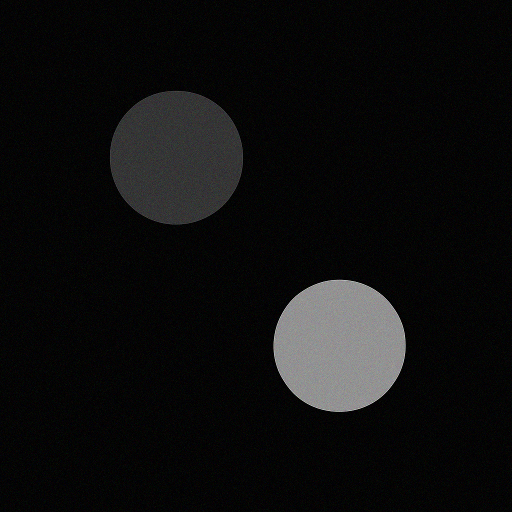
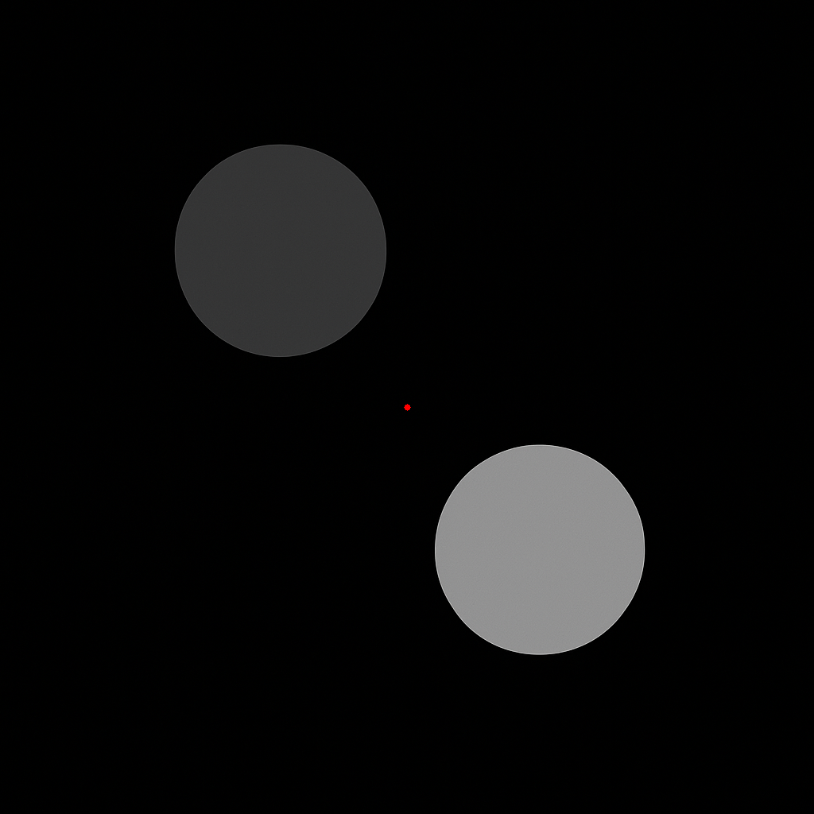

# 📘 Computer Vision Takehome Assignment 2

This assignment demonstrates core image processing techniques using OpenCV and Python:

- ✅ Task 1: Add Gaussian noise and perform Otsu's thresholding  
- ✅ Task 2: Perform region growing segmentation

---

## 📁 Folder Structure

```
Computer_Vision_Takehome_Assignment_2/
├── images/
│   └── input.png          
├── outputs/
│   ├── task1/
│   │   ├── noisy_image.png
│   │   └── otsu_segmented.png
│   ├── task2/
│   │   ├── region_grown.png
│   │   └── region_seeded.png
├── Task_1.ipynb
├── Task_2.ipynb
└── README.md
```

---

## 🛠️ Setup Instructions

1. ✅ Ensure Python 3.8 or higher is installed.  
2. ✅ Install required packages using pip:

```bash
pip install opencv-python numpy matplotlib
```

3. ✅ Open and run the notebooks in Jupyter or your preferred IDE:

```bash
jupyter notebook Task1_Otsu_Thresholding.ipynb
```

---

## 📌 Task Descriptions

### 🧪 Task 1: Gaussian Noise + Otsu Thresholding
- A synthetic grayscale image with 3 pixel values (background and 2 objects) is created.
- Gaussian noise is added to simulate real-world noise.
- Otsu’s thresholding is applied to segment the noisy image.
- **Outputs:**
  - `noisy_image.png` – Image after adding noise
  - `otsu_segmented.png` – Binary segmentation result

### 🌱 Task 2: Region Growing
- Region growing is performed starting from a manually chosen seed pixel.
- Pixels similar in intensity (within a threshold) are added recursively.
- A grayscale image is used for segmentation.
- **Outputs:**
  - `region_seeded.png` – Image with the seed point marked
  - `region_grown.png` – Result of region-growing algorithm

---

## 🖼️ Output Preview

### Task 1 – Otsu Thresholding
| Original | Noisy Image | Otsu Segmented |
|----------|-------------|----------------|
|  |  |  |

### Task 2 – Region Growing
| Seeded Image | Region Grown |
|--------------|--------------|
|  |  |

---

## 👨‍💻 Author

Hiruna De Silva – [GitHub](https://github.com/HirunaD/EC7212-Take-Home-Assignment-2)